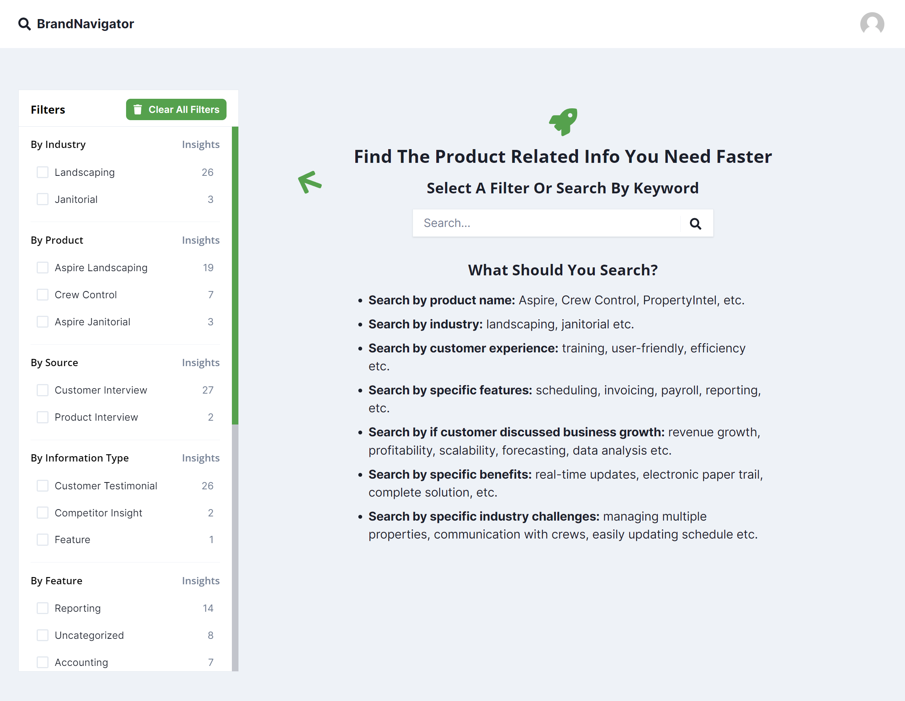
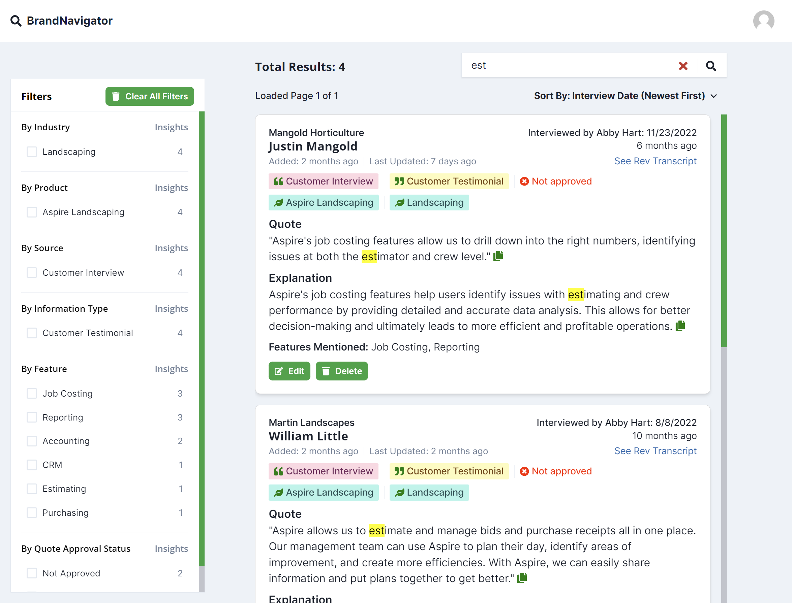
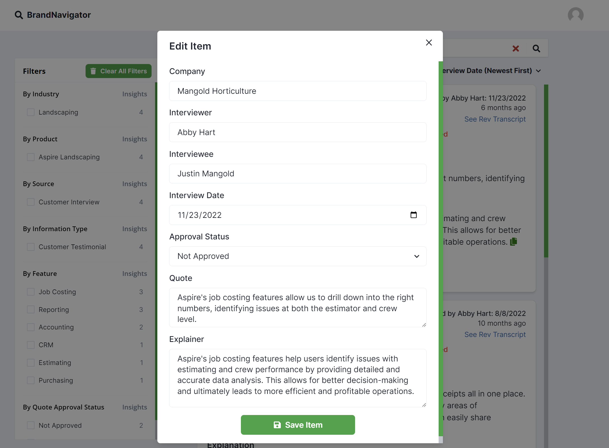
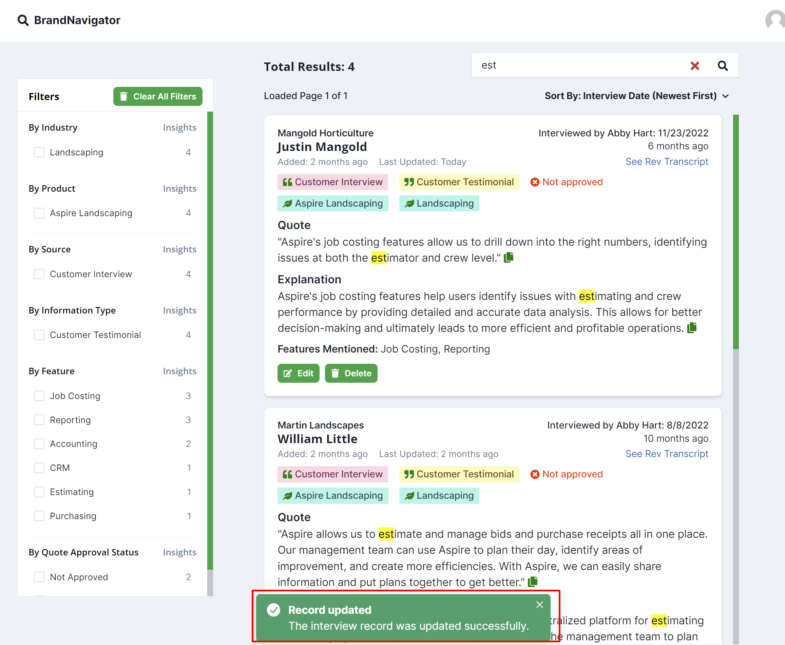
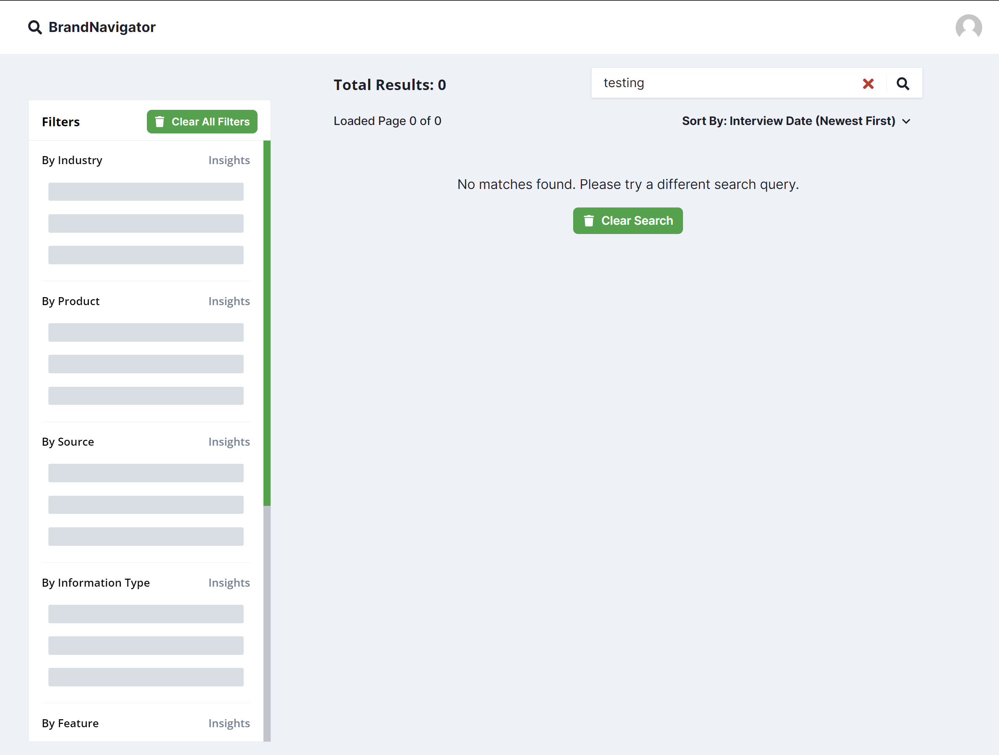
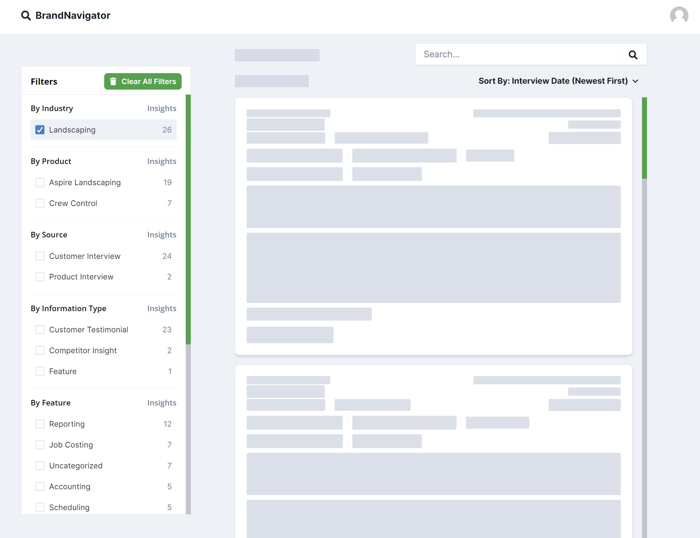

# Aspire Software Transcript Search App Showcase
This app helps the marketing team at Aspire Software easily search and filter transcripts of product and customer interviews.

## Features
Search transcripts by keyword.
Filter transcripts by industry, competitor, feature, etc.

## Technology
* Next.js
* Firebase
* PlanetScale
* React
* ChakraUI
## Deployment
The app is deployed to Vercel.

## Problem
The marketing team at Aspire Software was having difficulty searching and filtering transcripts of product and customer interviews. They needed a way to easily find the information they were looking for. They originally tried a Google sheet but this was inefficient and didn't solve the problem.

## Solution
This app solves the problem by providing a simple and easy-to-use interface for searching and filtering transcripts.

## Screenshots

